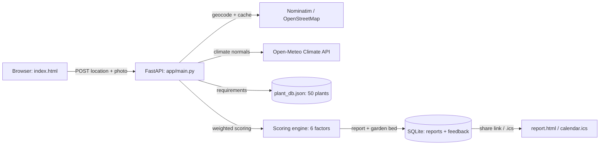

# GreenScope - AI Gardening Intelligence for India

## Discover what you can grow based on your location, soil, and garden conditions

GreenScope combines real climate data, plant science, and garden analysis to generate explainable plant recommendations with suitability scores, garden risk assessment, and comparison tables. India-focused with religious and health-beneficial plants.

## Quick Start

```bash
pip install -r requirements.txt
python -m uvicorn app.main:app --reload --port 8000
```

Open `http://localhost:8000` in a browser (single URL serves both API and frontend).

## How It Works

```
Location (any Indian city/village) + Photo
      |
      v
Real APIs: Nominatim geocoding + Open-Meteo climate data
      |
      v
Plant Database (50 Indian plants with growing requirements)
      |
      v
Scoring Engine (climate 25%, pH 20%, sunlight 15%, water 15%, soil 15%, photo 10%)
      |
      v
Top 15 Candidates with suitability scores + breakdown
      |
      v
Categories | Garden Risk | Comparison Table | Why Not?
      |
      +---> Watering Schedule Calculator (frequency, amounts, seasonal notes)
      +---> Pest & Disease Alerts (category-specific, environment-triggered)
```

## Features

- **Real Geocoding**: Nominatim/OpenStreetMap — works with any location in India
- **Real Climate Data**: Open-Meteo API — temperature, rainfall by coordinates
- **Scoring Engine**: Deterministic scoring based on climate, pH, sunlight, water, soil, photo
- **Indian Plant Database**: 50 plants including Tulsi, Neem, Ashwagandha, Brahmi, Curry Leaf
- **Religious & Health Focus**: Sacred plants with Ayurvedic benefits
- **Photo Analysis**: Pillow-based image analysis (brightness, vegetation, soil detection)
- **Environment Card**: Shows avg temp, rainfall, sunlight, pH, soil type, frost risk
- **Garden Risk Assessment**: Sunlight, water, temperature, soil health with warnings
- **Best For You Categories**: Best Overall, Low-Water, Fastest Harvest, Flower, Herb
- **Comparison Table**: Side-by-side plant comparison (now with Water Score & Companion Notes columns)
- **Why Not?**: Explains why rejected plants scored lower
- **Interactive Map**: Leaflet map showing geocoded location
- **Dark Mode**: Toggle for dark/light theme
- **Seasonal Calendar**: What to plant this month for your location
- **Open Report Link**: Shareable public report page
- **HTML Download**: Downloadable styled report (print to PDF)
- **Custom Locations**: Type any location name, not limited to dropdown
- **Input Validation**: Size limits, error handling, graceful fallbacks
- **Watering Schedule Calculator**: Personalized watering frequency, per-session amounts, weekly schedule, seasonal notes
- **Pest & Disease Alerts**: Category-specific alerts triggered by environmental conditions with risk level and actionable advice
- **Deterministic Chat Assistant**: Floating chat widget using local plant database (no LLM, no API keys, works offline) — answers questions about plant care, categories, field sizes, watering, pests, seasons
- **Purchase Tracking**: Record seeds, saplings, fertilizer, tools costs per plant recommendation
- **Sales Tracking**: Record harvest revenue (produce, herbs) per plant
- **Ledger / Profit & Loss Dashboard**: Total spent vs. earned per plant and overall with net profit
- **Moon Phase & Biodynamic Calendar**: Current moon phase, biodynamic planting category (root/leaf/fruit/flower), Panchang tithi/paksha/lunar month, 30-day auspicious planting dates
- **Header Topic Navigation**: Quick links to all report sections (Analyze, Environment, Risk, Best For You, Garden Bed, Recommendations, Comparison, Ledger, Calendar)
- **Water Conservation Score**: 0-100 score per plant (water need vs. local rainfall); estimates liters/season saved vs. Bottle Gourd baseline; shown in plant cards and comparison table
- **Companion Planting Suggestions**: ~50 static rules; shows "grows well with" / "avoid near" per plant based on report's other recommendations
- **Regenerative Economics Dashboard**: `is_organic` flag on purchases; splits organic vs. conventional spend; estimates organic matter added (kg) and CO₂ offset (kg) from organic inputs (compost, vermicompost, neem cake, etc.)
- **Pollinator-Friendly Tagging**: 9 plants flagged; 🐝 badge on cards; API filter `pollinator_friendly=true`

## Demo Script (lead with differentiators, in this order)

1. **Tags** — point at badges on any recommendation: "Air-purifying, pollinator-friendly, companion hints — the app knows these plants relate to each other, not just their climate numbers."
2. **"Why Not?"** — scroll to rejected plants: "Every rejection has a reason. No black box."
3. **Feedback loop** — tap 👍 on a card: "Votes accumulate per plant, so recommendations improve with real gardener feedback."
4. **ICS export** — "One click adds season-aware planting reminders to Google Calendar — Kharif crops in June, Rabi in October."
5. **Udaipur vs Kolkata** (30-second wow): same plant, different score, clear reason why.
6. **Point at the frost/heat banner and flip the Hindi toggle** — easy to miss in a fast demo, so call them out explicitly.

**"Where's the AI?" (prewritten answer):** "We chose deterministic, explainable scoring over a black-box model because gardeners need to trust *why* a plant was recommended — every score decomposes into six weighted factors you can inspect. The photo analysis is real pixel-level computer vision: brightness, vegetation index, and soil detection with calibrated confidence scores, honestly labeled as estimates. Explainability *is* the intelligence here."

**Key talking points:**
- Real APIs: Nominatim geocoding (any location in India) + Open-Meteo climate data
- 50 Indian plants including religious/health species (Tulsi, Neem, Ashwagandha, Brahmi)
- Explainable scoring with per-factor breakdown — not a black box
- Garden risk assessment with actionable warnings
- Shareable report pages with map pins
- **Custom Locations**: Type any location name (not limited to dropdown)

## API Endpoints

| Method | Endpoint                      | Description              |
|--------|-------------------------------|--------------------------|
| `GET`  | `/`                           | Serve frontend           |
| `POST` | `/api/v1/geocode`             | Geocode location (Nominatim) |
| `POST` | `/api/v1/generate-report`     | Generate gardening report |
| `GET`  | `/api/v1/reports/{id}`        | Retrieve report data     |
| `GET`  | `/report/{id}`                | Share report page        |
| `GET`  | `/api/v1/plant-this-month`    | Seasonal planting calendar|
| `GET`  | `/api/v1/reports/{id}/calendar.ics` | Season-aware planting reminders (ICS) |
| `POST` | `/api/v1/feedback`            | Thumbs up/down per plant suggestion |
| `GET`  | `/api/v1/feedback/summary`    | Aggregated helpfulness per plant |
| `POST` | `/api/v1/chat`                | Deterministic chat assistant (local plant DB) |
| `GET`  | `/api/v1/health`              | Health check             |
| `POST` | `/api/v1/purchases`           | Record a purchase (seeds, saplings, fertilizer, tools) |
| `GET`  | `/api/v1/purchases/{report_id}` | List purchases for a report (optional plant filter) |
| `POST` | `/api/v1/sales`               | Record a sale/harvest    |
| `GET`  | `/api/v1/sales/{report_id}`   | List sales for a report (optional plant filter) |
| `GET`  | `/api/v1/ledger/{report_id}`  | Profit/loss summary + regenerative economics (organic spend, organic matter kg, CO₂ offset kg) |
| `GET`  | `/api/v1/moon-calendar`       | Moon phase, biodynamic advice, Panchang, auspicious dates |

### Generate Report Request Body

```json
{
  "location": {"location": "Delhi, NCR"},
  "photo": {"image_id": "img1", "filename": "garden.jpg", "base64": "..."},
  "num_recommendations": 15,
  "category": "herb",
  "pollinator_friendly": true
}
```

| Field | Type | Required | Description |
|-------|------|----------|-------------|
| location | object | Yes | Location input with `location` string, optional `latitude`/`longitude` |
| photo | object | No | Garden photo with `image_id`, `filename`, `base64` |
| num_recommendations | integer | No (default 15) | Number of recommendations (1-20) |
| category | string | No | Filter by plant category: `herb`, `fruit`, `vegetable`, `spice`, `pulse`, `flower` |
| pollinator_friendly | boolean | No | Filter for pollinator-friendly plants only |

**Category aliases:** `decorative` → `flower` (case-insensitive, whitespace trimmed). Invalid category returns 422.

**Category aliases:** `decorative` → `flower` (case-insensitive, whitespace trimmed). Invalid category returns 422.

## What's Real vs Mocked

| Feature              | Status | Details                                         |
|----------------------|--------|-------------------------------------------------|
| Geocoding            | Real   | Nominatim/OpenStreetMap (any location in India) |
| Climate data         | Real   | Open-Meteo API (temperature, rainfall by coords)|
| Scoring engine       | Real   | Deterministic scoring from plant DB             |
| Plant database       | Real   | 50 Indian plants with full growing requirements |
| Photo analysis       | Real   | Pillow-based brightness/vegetation analysis     |
| Persistence          | Real*  | SQLite (`reports.db`); *ephemeral disk on free tiers — survives a demo session, wiped on redeploy/spin-down |
| Soil type inference  | Mocked | Based on latitude/region heuristics              |

## Scoring Algorithm

| Factor   | Weight | What It Measures                              |
|----------|--------|-----------------------------------------------|
| Climate  | 25%    | Temperature range match                       |
| pH       | 20%    | Soil pH compatibility                         |
| Sunlight | 15%    | Sun hours vs requirement                      |
| Water    | 15%    | Rainfall vs water needs                       |
| Soil     | 15%    | Soil type match                               |
| Photo    | 10%    | Garden observation bonus (Pillow analysis)    |

## Supported Locations

Works with **any location in India** via Nominatim geocoding. Pre-configured with 16 major cities:

Mumbai, Delhi, Bengaluru, Chennai, Kolkata, Hyderabad, Pune, Jaipur, Ahmedabad, Lucknow, Bhopal, Patna, Shimla, Srinagar, Thiruvananthapuram, Udaipur.

Plus free-text input for any other location (Varanasi, Kochi, Indore, etc.)

## Religious & Health Plants

| Plant | Benefits |
|-------|----------|
| Tulsi | Sacred basil, immunity booster, respiratory health |
| Neem | Natural pest repellent, blood purifier, Ayurvedic |
| Ashwagandha | Adaptogen for stress, strength, vitality |
| Brahmi | Brain tonic, memory, cognition |
| Amla | Richest Vitamin C source, immunity |
| Giloy | Immunity booster, fever treatment |
| Curry Leaf | Digestive health, blood sugar control |
| Aloe Vera | Skin healer, digestive aid |
| Lemongrass | Mosquito repellent, tea, ceremonies |
| Moringa | Superfood, all parts edible |
| Turmeric | Anti-inflammatory, sacred in rituals |
| Coriander | Digestive, cholesterol control |
| Fenugreek | Diabetes control, fasting food |
| Marigold | Sacred flower, pest deterrent |

## Tech Stack

- **Backend:** FastAPI, Pydantic v2, Python 3.10+, Pillow, httpx, slowapi (rate limits)
- **Frontend:** HTML5, Tailwind CSS (CDN), Leaflet maps, Vanilla JS
- **APIs:** Nominatim (geocoding, cached), Open-Meteo (climate)
- **Data:** JSON plant database, SQLite persistence (`reports.db`, ephemeral on free tiers)
- **Tests:** pytest (50 tests passing)

## Tests

```bash
python -m pytest tests/ -v
```

## Project Structure

```
GreenScope/
  app/
    main.py           # FastAPI backend + scoring engine + API integrations
    plant_db.json     # Indian plant knowledge base (50 plants)
  static/
    index.html        # Frontend with custom location input
    report.html       # Shareable report page
  tests/
    test_api.py       # API tests (50 cases)
  requirements.txt
  render.yaml         # One-click Render deploy config
  .gitignore
  LICENSE             # MIT
  README.md
```

## Architecture



## Deploy (Render)

1. Dashboard → **New** → **Web Service** → connect this repo.
2. Build: `pip install -r requirements.txt`
3. Start: `uvicorn app.main:app --host 0.0.0.0 --port $PORT`
4. Note: free-tier disk is **ephemeral** — `reports.db` (share links, feedback
   votes) survives until the next deploy or ~15 min idle spin-down. For a live
   demo session this is a non-issue; for persistent reports use a hosted
   Postgres and set `DATABASE_URL`.

## Demo Video (60–90s shot list for pre-screening)

> Record a screen capture following this script; upload unlisted to YouTube
> and paste the link here.

1. **0:00–0:10** — Homepage. "GreenScope tells Indian gardeners what to grow,
   and *why*. Type any location — watch the map pin drop on real geocoded
   coordinates."
2. **0:10–0:25** — Generate a report for Udaipur. Point at the LIVE DATA badge:
   "Real climate data, not mocks." Scroll the environment card + frost/heat banner.
3. **0:25–0:50** — **Lead with Why Not.** Open the score breakdown bars, then
   "Why Not These Plants?": "Every rejection has a reason. No black box —
   gardeners can trust this."
4. **0:50–1:05** — Udaipur vs Kolkata side-by-side: "Same plant, different
   score, clear reason why. The engine reasons."
5. **1:05–1:20** — Garden bed card, Hindi toggle, .ics download:
   "One bed that grows well together, in your language, with reminders."
6. **1:20–1:30** — "Deterministic, explainable scoring over a black-box model —
   because gardeners need to trust *why*."

---

## Roadmap

### Recently Added

- **Watering Schedule Calculator** — Personalized watering frequency, amounts per session, weekly schedule, and seasonal notes based on plant water needs, rainfall, temperature, humidity, soil type, and frost risk
- **Pest & Disease Alerts** — Category-specific alerts triggered by environmental conditions (temperature, humidity, rainfall) with risk level and actionable advice
- **Deterministic Chat Assistant** — Floating chat widget using local plant database (no LLM, no API keys, works offline). Answers questions about plant care, categories (flowers, fruits, vegetables, herbs, spices, pulses, decorative), field sizes (large farm, balcony/container), watering, pests, and seasons.
- **Purchase & Sales Tracking + Ledger** — Record seed/fertilizer/tool costs and harvest revenue per plant; profit/loss dashboard with net profit per plant and overall
- **Moon Phase & Biodynamic Calendar** — Current moon phase, biodynamic category (root/leaf/fruit/flower), Panchang (tithi/paksha/lunar month), 30-day auspicious planting dates
- **Header Topic Navigation** — Quick links to all report sections
- **Water Conservation Score** — 0-100 score comparing plant water needs vs. local rainfall; estimates liters/season saved vs. high-water baseline (Bottle Gourd); shown per plant and in comparison table
- **Companion Planting Suggestions** — Static rule table (~50 pairs) for good/avoid companions; `companion_suggestions()` function checks against report's recommendations; displayed per plant card and in comparison table
- **Regenerative Economics Dashboard** — `is_organic` flag on purchases splits spend (organic vs. conventional); converts organic inputs (compost, vermicompost, neem cake, etc.) to estimated organic matter added (kg) and CO₂ offset (kg); shown in Ledger with net profit
- **Pollinator-Friendly Tagging** — `pollinator_friendly` boolean on 9 plants (Marigold, Sunflower, Hibiscus, Jasmine, Rose, Lavender, Mustard, Coriander, Tulsi, Lemongrass, Lotus); badge on recommendations; `pollinator_friendly=true` filter in API request

### Deferred by Design

- **AI chatbot / RAG Q&A (black-box LLM)** — Intentionally not built. Our core differentiator is deterministic, explainable scoring; a black-box chat layer would work against that pitch. The deterministic assistant above provides Q&A without sacrificing explainability.

### In Progress (High Value, Near-Term)

- CSV/Excel export of recommendations
- Container/balcony gardening mode (UI filter + pot-size/depth in plant_db.json)
- Soil amendment suggestions (pH/soil mismatch → actionable tips)
- Harvest timeline / Gantt view (sowing→harvest visual per plant)
- Companion planting matrix (visual grid of 50 plants help/hurt)
- Yield/cost estimator tied to ledger (ROI per garden bed)
- Redis/in-memory TTL caching for Nominatim/Open-Meteo

### Deferred for Time (Larger Scope)

- PostgreSQL migration (replace ephemeral SQLite on free-tier hosting)
- PWA support for offline access to saved reports
- Multi-language expansion (Tamil, Bengali, Marathi, Gujarati)
- Plant health tracker over time (photos/notes/trends per plant)

---

**GreenScope** - Explainable garden intelligence for Indian spaces.
